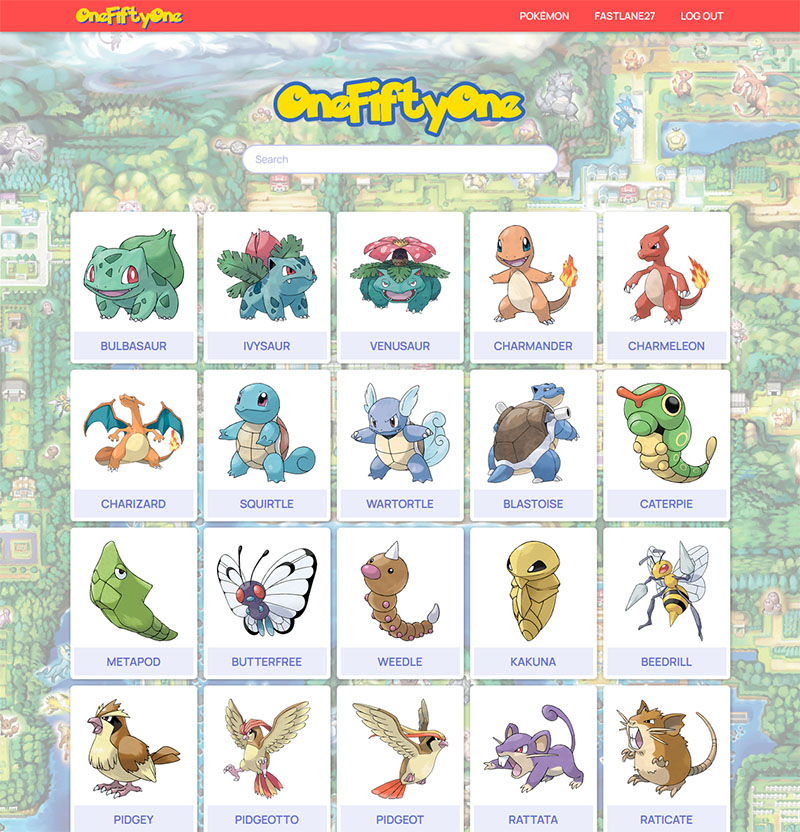

# OneFiftyOne

OneFiftyOne is a basic web application built with React that consumes the [PokeAPI](https://pokeapi.co/) to provide data on the original 151 Pokemon. Users can view and search through the list of Pokemon as well as click on individual Pokemon to view more detailed information. If the user has registered on the app, they can participate in discussions with other users by leaving comments on any of the detail pages.

## Screenshots

## Technologies Used
- React
- Node.js
- Express
- MongoDB
- Mongoose
- Sass

## Getting Started
**[Click here](http://one-fifty-one.herokuapp.com/) to view the app.**  
[Click here](https://trello.com/b/mFqniWzP/one-fifty-one) to view the trello board.

## Next Steps
- Add sort functionality for all Pokemon
- Add user profile pages
- Add user avatars
- Add the ability for users to favorite Pokemon
- Add a forum page where users can make posts and respond to them
